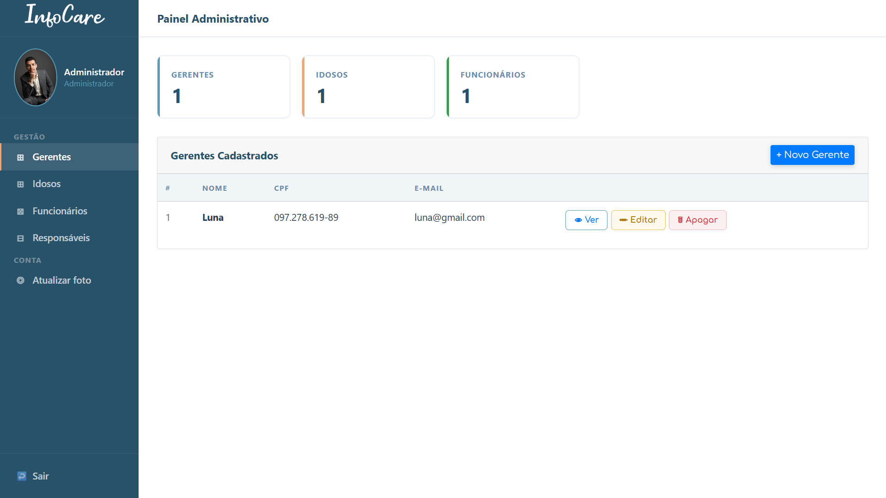
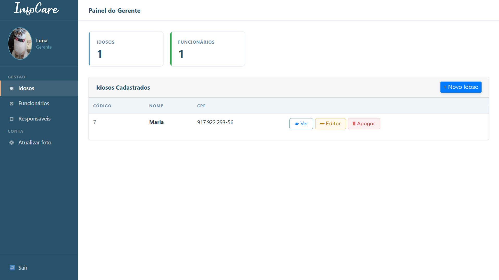
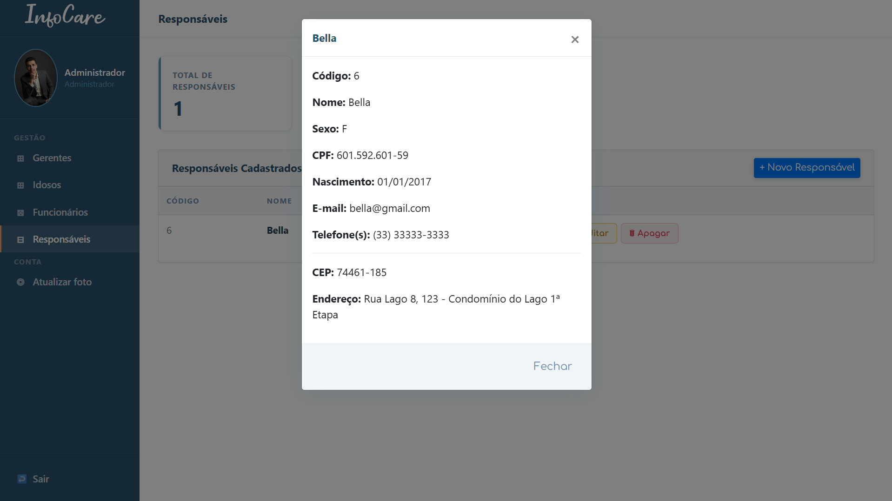
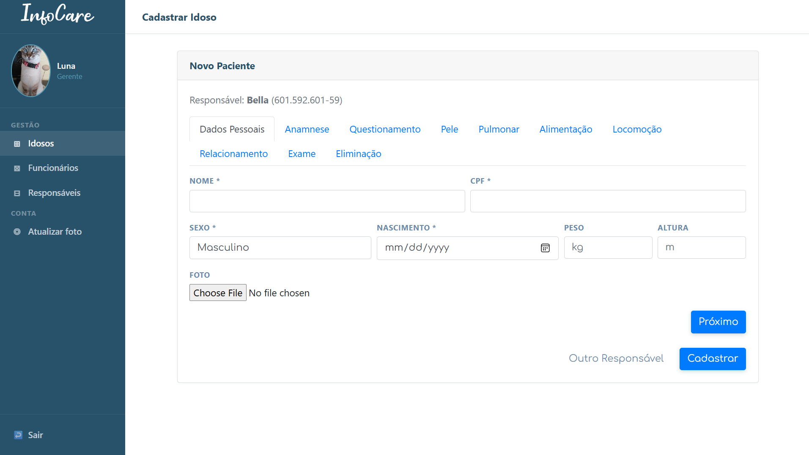
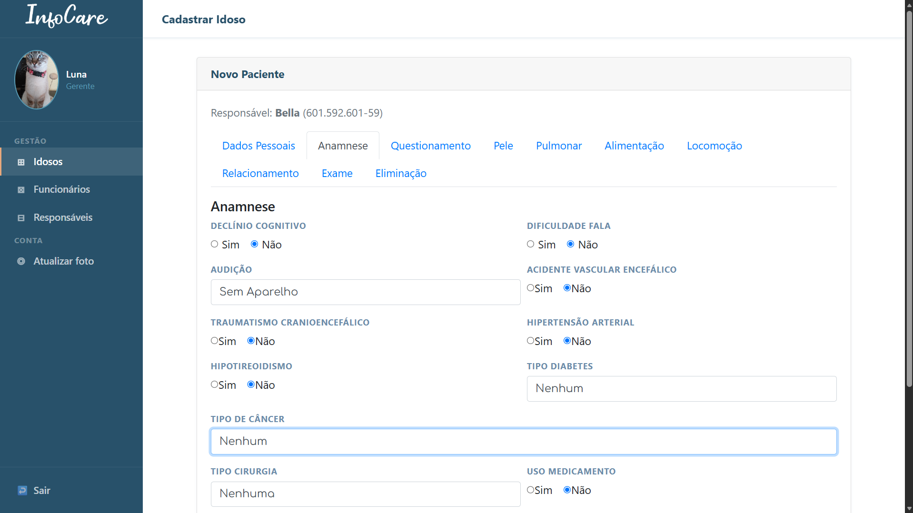
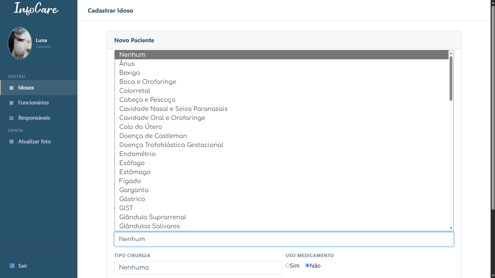
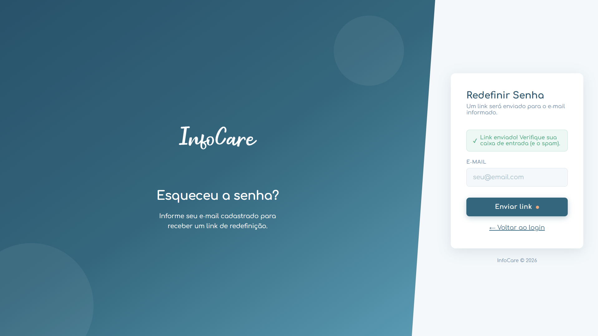
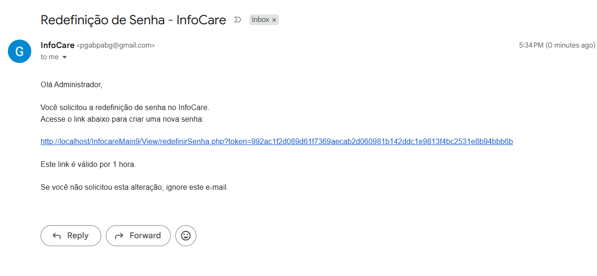
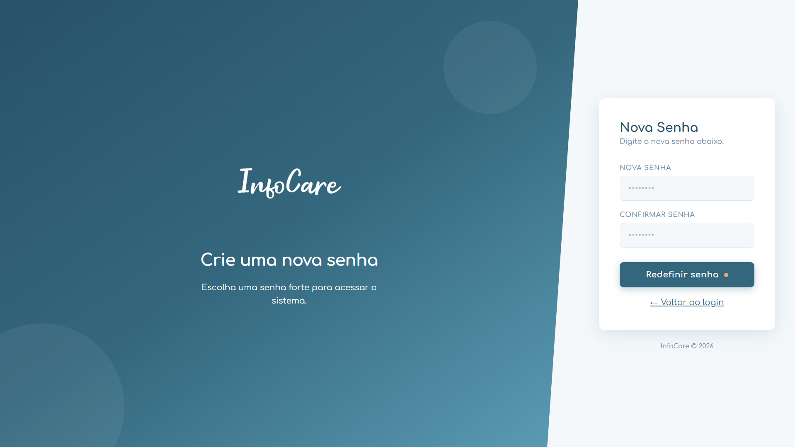

<h1 align="center">
  
</h1>

<p align="center">
  
  
  
  
  
</p>

# Índice

* [Descrição do Projeto](#-descrição-do-projeto)
* [Status do Projeto](#-status-do-projeto)
* [Funcionalidades](#-funcionalidades)
* [Demonstração](#️-demonstração)
* [Acesso ao Projeto](#-acesso-ao-projeto)
* [Tecnologias Utilizadas](#-tecnologias-utilizadas)
* [Estrutura do Projeto](#-estrutura-do-projeto)
* [Pessoas Desenvolvedoras](#-pessoas-desenvolvedoras)
* [Licença](#-licença)

---

## 📖 Descrição do Projeto

**InfoCare** é um sistema integrado de gestão para casas de repouso, desenvolvido como Trabalho de Conclusão de Curso (TCC). O sistema permite o gerenciamento completo de idosos, incluindo prontuários médicos, cadastro de funcionários, responsáveis e administradores, além de funcionalidades como recuperação de senha por e-mail e geração de relatórios em PDF.

O projeto foi **totalmente refatorado** a partir de uma base legada, migrando de `mysqli` para **PDO**, adotando uma arquitetura mais limpa com **MVC simplificado**, layout responsivo moderno e diversas melhorias de segurança e usabilidade.

---

## 🚧 Status do Projeto

<h4 align="center">
  ✅ Projeto Concluído ✅
</h4>

O sistema atende a todos os requisitos propostos no TCC e está pronto para uso em ambiente de produção (com as devidas configurações de servidor).

---

## 🔨 Funcionalidades

### 👥 Gestão de Usuários

Cada tipo de usuário possui seu próprio painel (`homeAdm`, `homeGerente`, `homeFuncionario`, `homeResponsavel`), com controle de acesso e navegação adaptados ao seu papel:

- `Administrador`: cadastra e gerencia gerentes, funcionários, responsáveis e idosos.
- `Gerente`: gerencia idosos, funcionários e responsáveis.
- `Funcionário (Cuidador)`: visualiza idosos e cria prontuários diários.
- `Responsável (Familiar)`: acompanha os idosos vinculados à sua conta.

### 🏥 Prontuário Completo

Cadastro de idoso com **10 abas** de avaliação, somando mais de 80 campos clínicos:

- `Dados Pessoais`: identificação do idoso e vínculo com responsável.
- `Anamnese`: histórico médico e patologias prévias.
- `Questionamento`: hábitos, sinais vitais, alergias e convênio.
- `Pele`: integridade, hidratação e lesões.
- `Pulmonar`: tosse, auscultação e dispneia.
- `Alimentação`: deglutição, uso de sonda e restrições alimentares.
- `Locomoção`: cadeirante, acamado e apoio físico.
- `Relacionamento`: comunicação, agressividade e temperamento.
- `Exame`: hemograma, urina, hepatite, HIV e VDRL.
- `Eliminação`: evacuação, gases e uso de fralda.

Navegação fluida entre abas via JavaScript, com prontuário diário separado do prontuário fixo, busca de responsável por CPF com sugestão automática, e visualização/impressão do prontuário completo em formato PDF.

### 📸 Fotos de Perfil

Upload de foto para cada tipo de usuário (admin, gerente, funcionário, responsável, idoso), com armazenamento polimórfico em uma única tabela `foto`.

### 🔒 Segurança

- Senhas com hash **bcrypt** (`PASSWORD_DEFAULT`).
- Controle de acesso baseado em tipo de usuário (`admin`, `gerente`, `funcionario`, `responsavel`).
- Proteção contra SQL Injection com **prepared statements** (PDO).
- Tokens de recuperação de senha com expiração de 1 hora.

### ✉️ Recuperação de Senha

- Envio de e-mail com link de redefinição usando **PHPMailer** e SMTP do Gmail.
- Token único, com expiração baseada no horário local do usuário.
- Limpeza automática de tokens expirados.

### ✅ Validações

- Validação de **CPF** (algoritmo oficial da Receita Federal).
- Validação de **CEP** com consulta automática à API ViaCEP.
- Validação de **data de nascimento** (não pode ser futura).
- Validação de **telefone** (mínimo 10 dígitos).
- Feedback visual com modais estilizados, sem `alert()` nativo.

### 🎨 Interface

- Layout **split-screen** na tela de login.
- **Sidebar** fixa com perfil, navegação e upload de foto.
- **Cards de KPI** com estatísticas (total de idosos, funcionários, etc.).
- **Tabelas responsivas** com modais de visualização, edição e exclusão confirmada.
- Design consistente com variáveis CSS para cores, fontes e sombras.
- Totalmente responsivo (mobile, tablet, desktop).

---

## 🖥️ Demonstração

Acesso ao sistema

<p align="center">
  
</p>
Tela de login com layout split-screen, validação de credenciais e link de recuperação de senha.

Painéis por tipo de usuário

<p align="center">
  
</p>
Painel do Administrador, com cards de KPI (gerentes, idosos, funcionários) e ações de visualizar, editar e apagar.

<p align="center">
  
</p>
Painel do Gerente, com visão dos idosos e funcionários sob sua gestão.

<p align="center">
  
</p>
Modal de visualização com os dados completos de um responsável, incluindo endereço obtido via CEP.

Cadastro de idoso com prontuário completo

<p align="center">
  
</p>
<p align="center"><em>Navegação pelas abas de cadastro, finalizando com a visualização do prontuário completo em PDF.</em></p>


<p align="center">
  
</p>
Aba Dados Pessoais, vinculada automaticamente ao responsável selecionado.

<p align="center">
  
</p>
Aba Anamnese, parte das 10 abas de avaliação clínica do prontuário.

<p align="center">
  
</p>
Campos condicionais com listas pré-definidas, como os tipos de câncer na aba de Anamnese.

Recuperação de senha por e-mail

<p align="center">
  
</p>
Solicitação do link de redefinição, informando apenas o e-mail cadastrado.

<p align="center">
  
</p>
Confirmação visual de que o link foi enviado.

<p align="center">
  
</p>
E-mail real enviado via PHPMailer, com token único válido por 1 hora.

<p align="center">
  
</p>

---

## 📁 Acesso ao Projeto

### 📋 Pré-requisitos

- **PHP** 8.0 ou superior
- **MySQL** 5.7 ou superior (ou MariaDB 10.3+)
- **Composer**, para gerenciar dependências
- Servidor web: **Apache** (WAMP, XAMPP, Laragon) ou **Nginx**

### 🛠️ Instalação

**1. Clone o repositório** ou extraia os arquivos na pasta do servidor (`htdocs`, `www`):

```bash
git clone https://github.com/seuusuario/InfoCare.git
```

**2. Instale as dependências com o Composer:**

```bash
cd InfoCare
composer install
```

**3. Crie o banco de dados e importe o schema:**

- Crie um banco de dados chamado `bdinfocare_refatorado` (ou o nome que preferir).
- Importe o arquivo `docs/bdinfocare_refatorado.sql`.

**4. Configure a conexão com o banco:**

Edite o arquivo `Dao/conexao.php` e ajuste as credenciais:

```php
private static $host = 'localhost';
private static $dbname = 'bdinfocare_refatorado';
private static $user = 'root';
private static $pass = '';
```

**5. Configure o envio de e-mail:**

Copie `configEmail.example.php` para `config/configEmail.php` e preencha com as credenciais do Gmail (use uma senha de app).

**6. Crie o primeiro administrador:**

Copie `setup.example.php` para `setup.php`, acesse `http://localhost/InfocareMain9/setup.php` no navegador e **apague o arquivo `setup.php` imediatamente após o uso**.

**7. Acesse o sistema:**

```
http://localhost/InfocareMain9/
```

---

## 🧰 Tecnologias Utilizadas

| Tecnologia | Uso |
|---|---|
| PHP 8.0+ | Back-end, lógica de negócios, MVC |
| MySQL | Banco de dados relacional |
| PDO | Conexão segura com o banco |
| Composer | Gerenciador de dependências |
| PHPMailer | Envio de e-mails (recuperação de senha) |
| Bootstrap 4.1 | Framework CSS para layout responsivo |
| jQuery | Manipulação do DOM e máscaras |
| jQuery Mask | Máscaras para CPF, CEP e telefone |
| ViaCEP API | Busca automática de endereço por CEP |
| HTML5 / CSS3 | Estrutura e estilização |
| JavaScript | Validações front-end e interatividade |

---

## 📂 Estrutura do Projeto

```
InfocareMain9/
├── Controller/       # Lógica de controle (CRUD, autenticação)
├── Dao/               # Data Access Objects (conexão e queries)
├── Model/             # Classes de domínio (entidades)
├── View/              # Páginas renderizadas (HTML + PHP)
├── css/               # Folhas de estilo (adm.css, styleLogin.css)
├── cssModal/          # Bootstrap 4 local
├── js/                 # Scripts JavaScript (validações, máscaras)
├── img/                # Imagens (logo, ícones, foto padrão)
├── upload/            # Fotos de perfil enviadas pelos usuários
├── vendor/            # Dependências gerenciadas pelo Composer
├── config/             # Configurações sensíveis (não versionado) usar config_example como referência.
├── composer.json      # Dependências do projeto
├── README.md          # Este arquivo
└── setup.example.php  # Modelo para criação do primeiro admin
```

---

## 👥 Pessoas Desenvolvedoras

<table>
  <tr>
    <td align="center">
      <a href="https://github.com/GabrielPabloG">
        <br>
        <sub><b>Gabriel Pablo Garcia</b></sub>
      </a>
    </td>
  </tr>
</table>

---

## 📄 Licença

Este projeto está licenciado sob a MIT License — veja o arquivo `LICENSE` para detalhes.